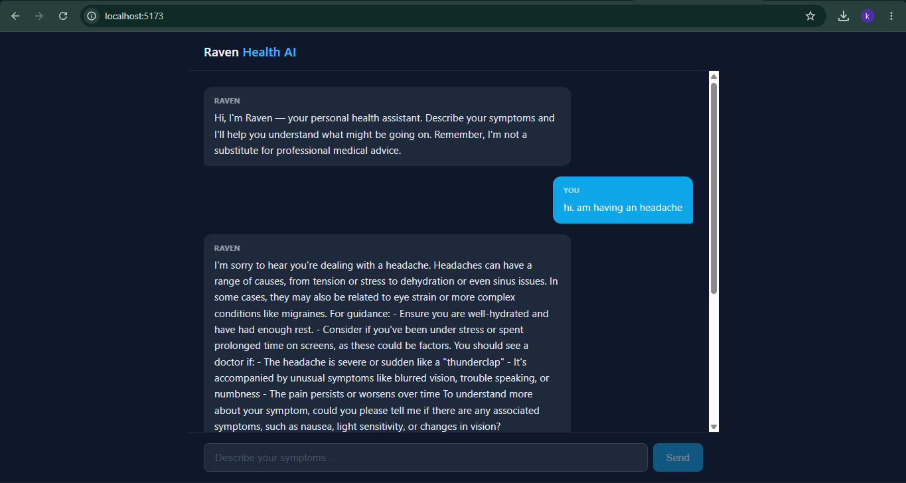

# Raven Health AI — Phase 2: Full-Stack Chat Implementation

Phase 2 builds a working end-to-end chatbot on top of the Phase 1 concept. It introduces a FastAPI backend that proxies requests to the OpenAI GPT-4o API and a React/Vite frontend that renders a real-time chat interface.

---

## What Was Built in Phase 2

### Backend (FastAPI)
- **`backend/main.py`** — creates the FastAPI app (`Raven Health AI`), loads environment variables, and mounts the chat router with CORS configured for the Vite dev server (`http://localhost:5173`).
- **`backend/chat.py`** — defines a `POST /chat` endpoint that accepts a user message and conversation history, prepends a system prompt that instructs the model to behave as *Raven* (an empathetic health-triage assistant), and forwards the full message thread to `gpt-4o`. Returns the model reply as JSON.
- **System prompt guidelines**: responses are structured into possible conditions, general guidance, and when to see a doctor; the model always asks one clarifying follow-up question and never diagnoses definitively.

### Frontend (React + Vite)
- **`App.jsx`** — top-level component that owns conversation state and the `sendMessage` async handler; proxies fetch calls to `/chat` (resolved by Vite's dev-server proxy).
- **`ChatWindow.jsx`** — renders the scrollable message list and auto-scrolls to the latest message.
- **`MessageBubble.jsx`** — displays individual messages styled by role (`user` / `assistant`).
- **`InputBar.jsx`** — controlled text input with send button; disabled while a request is in flight.

---

## Chat Interface



---

## Stack

| Layer | Technology |
|---|---|
| LLM | OpenAI GPT-4o |
| Backend | Python · FastAPI · Uvicorn |
| Frontend | React 18 · Vite |
| Env config | `python-dotenv` / `.env` |

---

## Running Locally

**Backend**
```bash
cd backend
pip install -r ../requirements.txt
uvicorn main:app --reload
```

**Frontend**
```bash
cd frontend
npm install
npm run dev
```

Set `API_KEY=<your-openai-key>` in a `.env` file at the project root before starting the backend.
